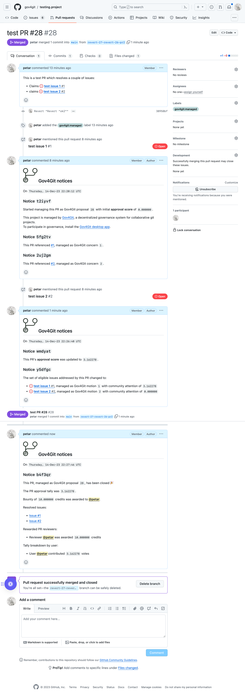

## Community member's manual

### Overview

To participate in governance, community members can interface with the system through the desktop app and the GitHub project's issues and PRs.

#### The desktop app

The desktop app is the primary point of contact where a community member user can:

- Create their decentralized Gov4Git identity (owned by the user themselves and not specific to any one community)
- Request to join a Gov4Git community
- Manage connections to multiple Gov4Git communities
- Manage multiple Gov4Git identities
- View the user's credits account balance in a Gov4Git community
- View and vote on open issues and PRs

#### The GitHub Web UI

The GitHub Web UI for issues and PRs displays the entire governance history and current state of each issue/PR in the form of chronologically ordered comments, called _governance notices_.

Notices capture information about:
- When Gov4Git beings management of an issue/PR
- What is the current score of an issue/PR based on community votes
- When a new PR claims to solve an issue
- When an issue is frozen due to the presence of an eligible PR claiming to solve it; as well as, when an issue is unfrozen due to absence of claimant PRs
- Breakdown of credit refunds when an issue/PR is cancelled or rejected
- Breakdown of rewards when a PR is accepted

This is an example of the life of an accepted PR:

And this is an example of the life of a rejected PR:

Additionally, community members participate in governance by creating new issues and PRs on GitHub.

Newly created issues/PRs are not managed by Gov4Git until they are explicitly labelled with `gov4git:managed`. Typically, the label will be applied by the community organizer after review. Once an issue/PR is managed, community members can cast or withdraw votes from it for as long as it is open or not frozen.

To claim that a PR resolves one or more issues, users must include the text `claims ISSUE_URL` in the description of the PR. Multiple claims are supported.
